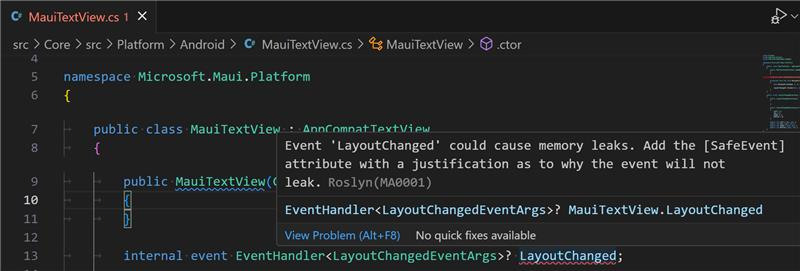

# memory-analyzers

A set of Roslyn C# code analyzers for finding memory leaks

This is still WIP, but the idea is:



Which you'd solve by adding:

```csharp
[SafeEvent("This event is internal, runs only on Windows, the subscriber has the same lifetime as the publisher.")]
```

Or:

```csharp
[SafeEvent("This event is proven safe by the FooTests.Bar test.")]
```
