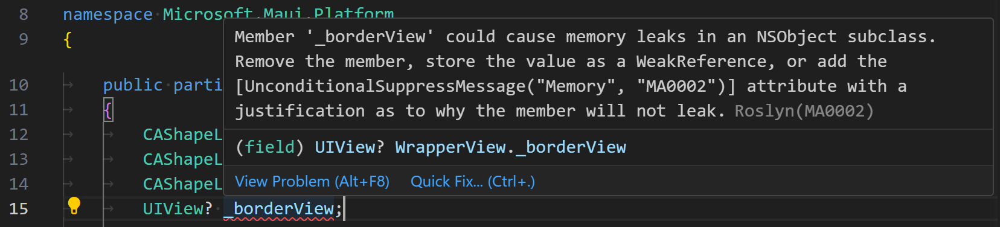
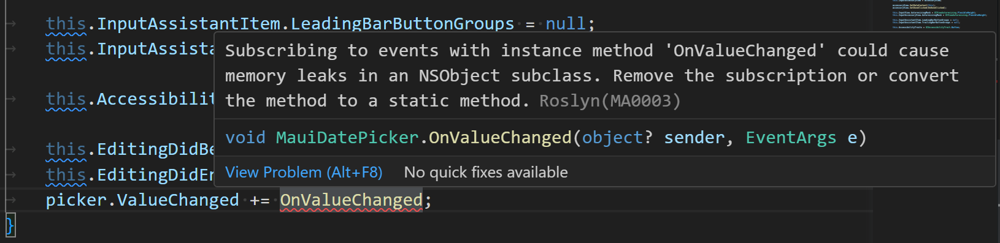

# memory-analyzers

A set of Roslyn C# code analyzers for finding memory leaks in iOS and
MacCatalyst applications.

## MA0001

Don't define `public` events in `NSObject` subclasses:

```
public class MyView : UIView
{
    // NOPE!
    public event EventHandler MyEvent;
}
```


## MA0002

Don't declare members in `NSObject` subclasses unless they are:

* `WeakReference` or `WeakReference<T>`
* Value types

```csharp
class MyView : UIView
{
    // NOPE!
    public UIView? Parent { get; set; }

    public void Add(MyView subview)
    {
        subview.Parent = this;
        AddSubview(subview);
    }
}
```



## MA0003

Don't subscribe to events inside `NSObject` subclasses unless:

* It's your event via `this.MyEvent` or from a base type.
* The method is `static`.

```csharp
class MyView : UIView
{
    public MyView()
    {
        var picker = new UIDatePicker();
        AddSubview(picker);
        picker.ValueChanged += OnValueChanged;
    }
    
    void OnValueChanged(object sender, EventArgs e) { }

    // Use this instead and it doesn't leak!
    //static void OnValueChanged(object sender, EventArgs e) { }
}
```


